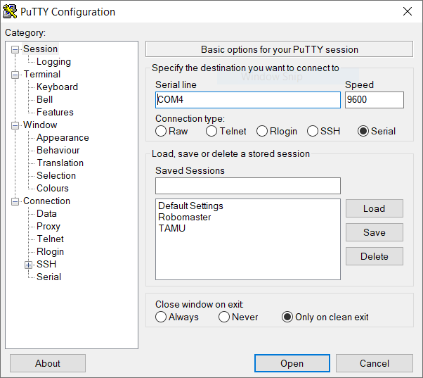

# Before Mashing the Keyboard

1. Need a GM6020 motor set to run at speed mode when using PWM.

2. Need a dev board, J-Link, micro USB cable.

# Getting Started

1. Compile the code.

2. Download the code to the development board(s).

3. Use a micro USB cable to connect the development board and your computer.

4. Identify the COM/serial port that identifies the development board. On Windows, you can use **Device Manager**.

5. Connect to the dev board via USB using **Putty**.

    Set the communication parameters:

    

# Commands You Can Play With & Observations

1. Type **'1'**: clockwise rotation.

2. Type **'2'**: anti-clockwise rotation.

3. Everything else: stop rotation.

Happy hacking!